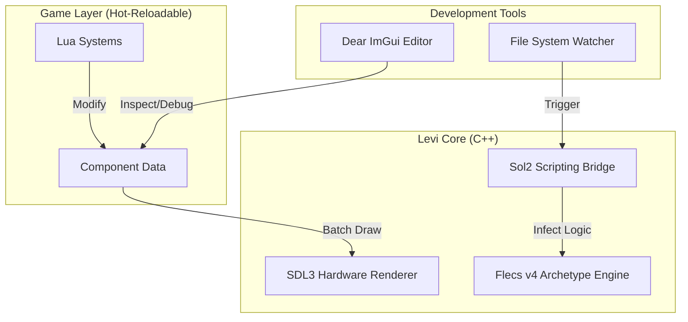

# 📄 Levi-ECS Engine

**Levi** is a high-performance 2D Game Engine focused on **Entity Component System (ECS)** architecture and **C++ Hot-reloading**. Built for modern game development workflows with a minimal feedback loop.

1. [Video Demo](#video-demo)
2. [Key Features](#-key-features)
3. [Architecture](#-architecture)
4. [Scripting Examples](#-scripting-examples)
5. [Build Instructions](#%EF%B8%8F-build-instructions)
6. [Project Structure](#-project-structure)
7. [License](#-license)

**Hot Reloading with Lua**


---
## Video Demo

https://github.com/user-attachments/assets/11788033-533e-47e3-a2be-a44198be4eff

---

## 🚀 Key Features
*   **Engine Core:** Powered by **C++20** and **SDL3**.
*   **Architecture:** Data-oriented design using **Flecs (v4)** ECS.
*   **Hot-reloading:** Change game logic on the fly using **Lua scripting** (via **sol2**).
*   **2D Rendering:** Hardware-accelerated sprites, animations, and lighting.
*   **Studio Editor:** Integrated GUI built with **Dear ImGui (Docking)**.
*   **Cross-platform:** Support for Windows and Linux via **CMake**.

---

## 🏗 Architecture


## 📜 Scripting Examples

This is how you declare a component/system in `lua`. Based on Hot-reloading, you can changes movement speed or logic and see the results intermediate on Game Viewport.
```lua
-- Demo Lua Script for Levi Engine
-- This script demonstrates ECS API usage and hot-reloading

print("=== Levi Lua Script Loaded ===")

-- Store entity IDs globally so we can modify them in onUpdate
entities = {}

-- Called once when script loads
function onInit()
    print("[Lua] onInit() - Creating entities...")
    -- local tmp = ECS.createEntity();
    -- ECS.addPosition(tmp, 100, 100)
    -- ECS.addSprite(tmp, "assets/player.jpg", 100, 100)
    
    -- Create a player entity with name
    local player = ECS.createEntity("Player")
    ECS.addPosition(player, 400, 300)
    ECS.addSprite(player, "assets/player.jpg", 100, 100)
    entities.player = player
    
    print("[Lua] Created player entity: " .. player)
    
    -- Create some test entities with names
    for i = 1, 3 do
        local entity = ECS.createEntity("Enemy_" .. i)
        ECS.addPosition(entity, 100 + i * 150, 200)
        ECS.addSprite(entity, "assets/player.jpg", 80, 80)
        table.insert(entities, entity)
    end
    
    print("[Lua] onInit() complete! Created " .. (#entities + 1) .. " entities")
end

-- Called every frame
local time = 0
function onUpdate(deltaTime)
    time = time + deltaTime
    
    -- Move player in a circle (Hot-reload test: change speed here!)
    if entities.player then
        local radius = 100
        local speed = 3.0  -- Try changing this value and saving!
        local centerX = 400
        local centerY = 300
        
        local x = centerX + math.cos(time * speed) * radius
        local y = centerY + math.sin(time * speed) * radius
        
        ECS.setPosition(entities.player, x, y)
    end
    
    -- Move other entities up and down
    for i, entityId in ipairs(entities) do
        local pos = ECS.getPosition(entityId)
        if pos then
            local offset = math.sin(time * 3 + i) * 50
            ECS.setPosition(entityId, pos.x, 200 + offset)
        end
    end
end

-- Called when script is about to be reloaded or engine shuts down
function onShutdown()
    print("[Lua] onShutdown() - Cleaning up...")
    -- Note: You don't need to delete entities here,
    -- they persist across script reloads!
end

print("[Lua] Script functions registered")
```

**Example Projects**: [Demo](examples/demo-projects)

## 🛠️ Build Instructions

### Prerequisites
*   **C++20 Compiler:** (MSVC 2022, GCC 11+, or Clang 13+)
*   **CMake:** version 3.20 or higher.
*   **Git:** To fetch third-party dependencies.

### 🪟 Windows (Visual Studio)
1.  Clone the repository:
    ```bash
    git clone https://github.com/your-username/levi.git
    cd levi
    ```
2.  **Using helper script:**
    ```powershell
    .\scripts\build.ps1
    ```
3.  **Using CMake manually:**
    ```bash
    mkdir build
    cmake -B build -S .
    cmake --build build --config Debug
    ```
4.  Run the editor from `bin/LeviEditor.exe`.

### 🐧 Linux (Ubuntu/Debian)
1.  Install dependencies (SDL3 requirements):
    ```bash
    sudo apt-get update
    sudo apt-get install build-essential git cmake libx11-dev libxext-dev libxrandr-dev libxinerama-dev libxcursor-dev libxi-dev libwayland-dev libxkbcommon-dev
    ```
2.  Clone and Build:
    ```bash
    git clone https://github.com/your-username/levi.git
    cd levi
    mkdir build
    cmake -B build -S .
    cmake --build build --config Debug
    ```
3.  Run the editor:
    ```bash
    ./bin/LeviEditor
    ```

---

## 📂 Project Structure
*   **`engine/`**: Core engine logic (ECS, Rendering, Math, Physics, Lua integration).
*   **`editor/`**: Studio GUI and developer tools.
*   **`projects/`**: User game projects (Lua scripts with hot-reloading support).
*   **`bin/`**: Compiled executables and binaries.
*   **`lib/`**: Compiled static libraries.

---

## 📄 License
This project is licensed under the MIT License - see the [LICENSE](LICENSE) file for details.
