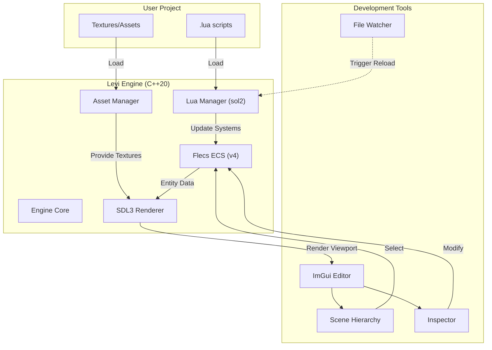

# 📄 Levi-ECS Engine

**Levi** is a high-performance 2D Game Engine focused on **Entity Component System (ECS)** architecture and **C++ Hot-reloading**. Built for modern game development workflows with a minimal feedback loop.

1. [Video Demo](#video-demo)
2. [Key Features](#-key-features)
3. [Architecture](#-architecture)
4. [Scripting Examples](#-scripting-examples)
5. [Build Instructions](#%EF%B8%8F-build-instructions)
6. [Project Structure](#-project-structure)
7. [License](#-license)

**Hot Reloading with Lua**


---
## Video Demo

https://github.com/user-attachments/assets/11788033-533e-47e3-a2be-a44198be4eff

---

## 🚀 Key Features
*   **Engine Core:** Powered by **C++20** and **SDL3**.
*   **Architecture:** Data-oriented design using **Flecs (v4)** ECS.
*   **Hot-reloading:** Change game logic on the fly using **Lua scripting** (via **sol2**).
*   **Asset Management:** Centralized management for textures and resources.
*   **2D Rendering:** Hardware-accelerated sprites, animations, and lighting.
*   **Studio Editor:** Integrated GUI built with **Dear ImGui (Docking)**.
*   **Cross-platform:** Support for **Windows**, **Linux**, and **macOS** via CMake.

---

## 🏗 Architecture

The engine is designed with a clear separation between the C++ Core and the hot-reloadable Lua Game Layer.



### 🔄 Hot-Reloading Workflow

Levi uses a **non-destructive reloading** strategy. When a script is modified, the engine re-executes the Lua code while keeping the existing ECS world (entities and their components) intact.

```mermaid
sequenceDiagram
    participant User
    participant Watcher as File System Watcher
    participant Manager as Lua Script Manager
    participant State as sol::state (Lua VM)
    participant ECS as Flecs World

    User->>User: Modify movement.lua (Change speed)
    User->>Watcher: Save File
    Watcher->>Manager: Trigger "onFileChanged"
    
    rect rgb(40, 40, 40)
        Note over Manager, State: Hot-Reload Cycle
        Manager->>State: Call old "onShutdown()"
        Manager->>State: Reload script file & Re-execute
        Manager->>State: Call new "onInit()"
    end

    Manager->>ECS: Persistent Entity Data Remains!
    
    loop Every Frame
        Manager->>State: Call "onUpdate(deltaTime)"
        State->>ECS: Update Component Data (New Speed)
    end
```



---

## 📜 Scripting Examples

This is how you declare a component/system in `lua`. Thanks to hot-reloading, you can change movement speed or logic and see the results immediately in the Game Viewport.

```lua
-- Demo Lua Script for Levi Engine
print("=== Levi Lua Script Loaded ===")

entities = {}

function onInit()
    local player = ECS.createEntity("Player")
    ECS.addPosition(player, 400, 300)
    ECS.addSprite(player, "assets/player.jpg", 100, 100)
    entities.player = player
end

local time = 0
function onUpdate(deltaTime)
    time = time + deltaTime
    
    if entities.player then
        local radius = 100
        local speed = 3.0  -- Change this and save to see hot-reload!
        local x = 400 + math.cos(time * speed) * radius
        local y = 300 + math.sin(time * speed) * radius
        ECS.setPosition(entities.player, x, y)
    end
end
```

**Full Example Project**: [demo-project](projects/demo-project)

---

## 🛠️ Build Instructions

### Prerequisites
*   **C++20 Compiler:** (MSVC 2022, GCC 11+, or Clang 13+)
*   **CMake:** version 3.24 or higher.
*   **Ninja:** (Optional, but recommended for faster builds)

### 🪟 Windows (Visual Studio / Ninja)
```powershell
# Using the helper script
.\scripts\build.ps1
```

### 🐧 Linux (Ubuntu/Debian)
You can use the helper script to install dependencies automatically, or install them manually:

**Option A: Using the helper script**
```bash
chmod +x ./scripts/build.sh
./scripts/build.sh --deps  # Installs the packages listed below
./scripts/build.sh         # Builds the engine
```

**Option B: Manual installation**
The following packages are required for SDL3 and the engine:
```bash
sudo apt-get update
sudo apt-get install -y build-essential git cmake libx11-dev libxext-dev libxrandr-dev libxinerama-dev libxcursor-dev libxi-dev libwayland-dev libxkbcommon-dev
./scripts/build.sh  # Then build the engine as usual
```

### 🍎 macOS
```bash
# 1. Install build tools (requires Homebrew)
chmod +x ./scripts/build.sh
./scripts/build.sh --deps

# 2. Build the engine
./scripts/build.sh
```

### 🛠️ Manual CMake Build (All Platforms)
If you prefer not to use the helper scripts:

1. **Configure:**
   ```bash
   cmake -B build -S . -DCMAKE_BUILD_TYPE=Debug
   ```
2. **Build:**
   ```bash
   cmake --build build --config Debug
   ```
   *Note: On Linux, ensure you have installed the system dependencies listed in the Linux section first.*

---

## 📂 Project Structure
*   **`engine/`**: Core engine logic (ECS, Rendering, Assets, Lua integration).
*   **`editor/`**: Studio GUI and developer tools (Inspector, Hierarchy).
*   **`projects/`**: User game projects and assets.
*   **`third_party/`**: External libraries (SDL3, Flecs, Lua, sol2, ImGui).
*   **`bin/`**: Compiled executables and binaries.

---

## 📄 License
This project is licensed under the MIT License - see the [LICENSE](LICENSE) file for details.
